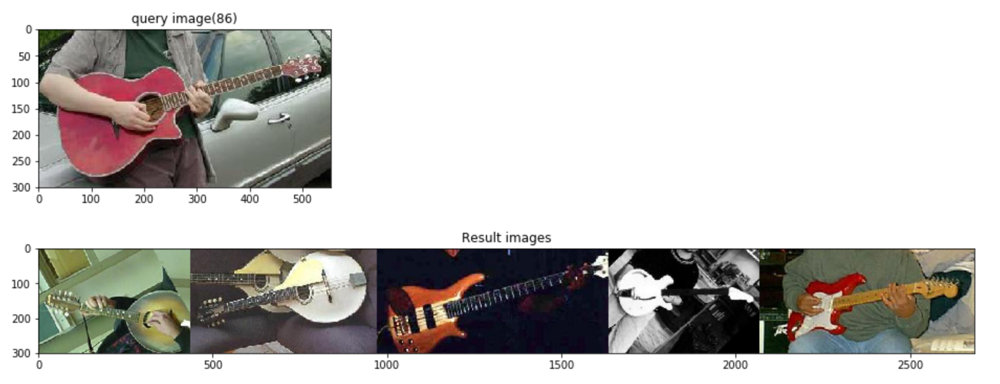

# Feature Extraction and Reverse Image Search on Caltech-101 Dataset
This notebook will guide you through the process of analyzing an image dataset using a pre-trained convolution network (VGG16) and extracting feature vectors for each image

Post analysis we try to demonstrate 'reverse image search' one of the widely popular applications of image analysis.

# Flow:
* Download [VGG16 pre-trained model](https://keras.io/applications/#vgg16) using keras

* Perform Feature Extraction :
  >Here we remove the last layer ie.,the softmax classification layer so our output model now has only 12 layers and the last layer would be fc2(Dense) a fully connected layer
  
* Get feature vectors for all the images then scale them down using [PCA](https://scikit-learn.org/stable/modules/generated/sklearn.decomposition.PCA.html)

* Use cosine distance between pca features to compare the query image to 5 number of closest images and return them as thumbnails

# Watch the Video:
[](https://youtu.be/FpWsLvXFCy0)


# Steps:

# Deploy on IBM Cloud:

* Create New Watson Studio Service instance (Catalog --> Watson Studio)
* Create a new Project in Watson Studio (New --> Standard project)
* Create a GPU Environment (Environment --> New Environment --> GPU Beta)
* Create a new Notebook (Add to project --> Notebook --> from url)
* Provision the notebook on newly created GPU Environment


# Run Locally:
* Clone the repository

```
git clone https://github.com/krishnac7/Reverse_image_search.git
```

* Navigate into the directory

```
cd Reverse_image_search-master
```

* Run using Jupyter notebooks

```
jupyter notebook
```

# Sample Output:


<!-- keep this -->
## License

This code pattern is licensed under the Apache License, Version 2. Separate third-party code objects invoked within this code pattern are licensed by their respective providers pursuant to their own separate licenses. Contributions are subject to the [Developer Certificate of Origin, Version 1.1](https://developercertificate.org/) and the [Apache License, Version 2](https://www.apache.org/licenses/LICENSE-2.0.txt).

[Apache License FAQ](https://www.apache.org/foundation/license-faq.html#WhatDoesItMEAN)


